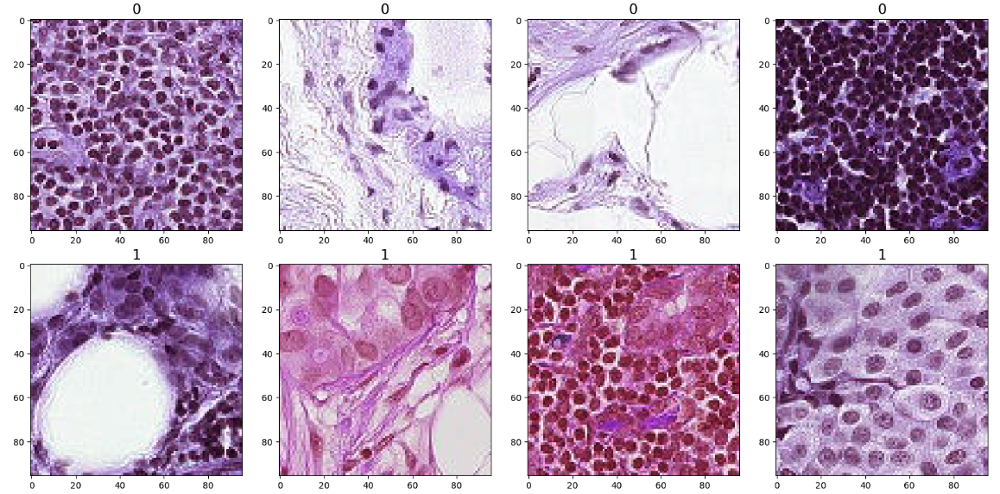

# histology_analysis
Data Science work on histology slides detecting cancer

# 1 

# a). Problem Statment

> ### Task - The problem is mainly a BINARY IMAGE CLASSIFICATION PROBLEM. The Problem focuses on identifying the presence of metastases from a 96 * 96 digital histopathology images

# b). Analysis of the problem Statment

> ## What Exactly the problem statment conveys to us?
> ### 1. The problem deals with the Binary Classification of the Image that has a shape of 96px * 96px. It involves identifying metastases from the 96px * 96px digital  images.

# 2.  Data Understanding

* The dataset contains the histopathological Images, each image is 96px * 96px. 

* A positive label indicates that the center 32x32px region of a patch contains at least one pixel of tumor tissue. Tumor tissue in the outer region of the patch does not influence the label. This outer region is provided to enable fully-convolutional models that do not use zero-padding, to ensure consistent behavior when applied to a whole-slide image.

# 3. Designing the Model  (See notebooks)

* ### **IS DATA RELEVANT TO THE PROBLEM ?**